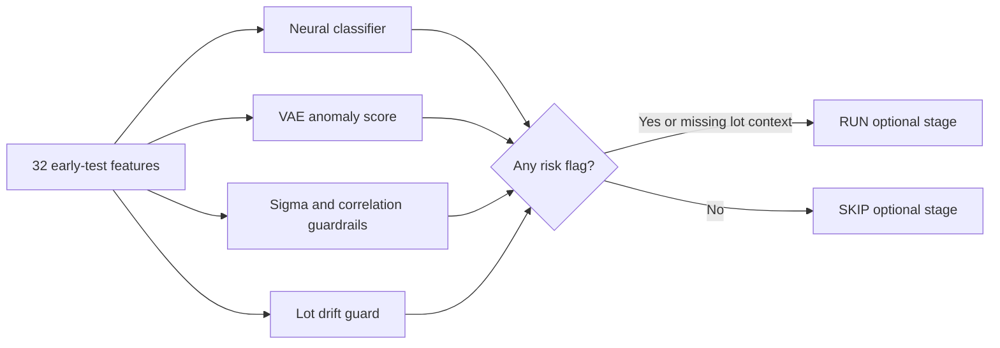
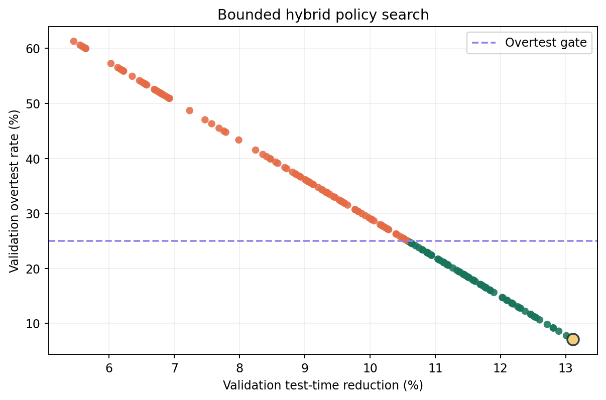
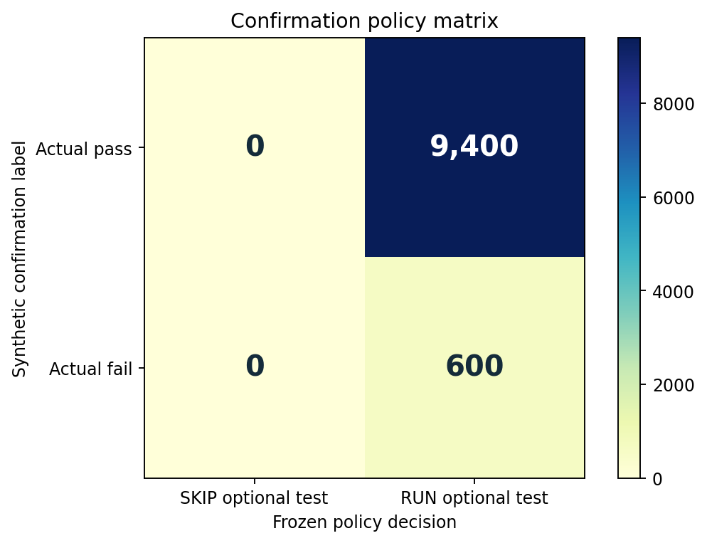

# Chip-Level Test Time Optimizer

[](https://github.com/rajendarmuddasani/Chip_Level_Test_Time_Optimizer/actions/workflows/ci.yml)
[](evidence/claims.json)
[](docs/DATA_CARD.md)

A safety-gated reference policy that decides whether each synthetic chip should run or skip a 15-unit optional test stage after 85 units of mandatory early testing.

## Evidence Dashboard

| Surface | Accepted evidence |
|---|---|
| Data | 58,000 independently generated synthetic chips in eight isolated benchmark splits, plus 10,000 disjoint post-freeze chips |
| Inputs | 32 voltage, current, timing, and resistance features; four known failure modes and one synthetic OOD mode |
| Selection | 198 measured candidates, including 180 eligible hybrid OR policies; confirmation data excluded from selection |
| Frozen bundle | `public_synthetic_hybrid_v1`; bundle `53ce0e9ccbd6...` with classifier/VAE/evidence SHA-256 verification |
| Post-freeze result | **13.524% simulated reduction**, **99.0% defect recall**, **6/600 escaped failures**, **4.149% over-test** |
| Weakest known mode | Timing shift recall: **98.571%** |
| Local API load | 100/100 success at concurrency 5; 10.22 requests/s; 470.50/565.37/721.73 ms p50/p95/p99 |
| Unmet objectives | **15% simulated reduction** and **zero observed escapes** |

> [!IMPORTANT]
> This repository is an independently generated synthetic reconstruction. It does not demonstrate production savings, physical-defect coverage, zero-escape guarantees, or approval for unsupervised manufacturing deployment.

The accepted percentage is not the raw chip skip rate. Under the declared cost model, every chip consumes 85 mandatory units and a skipped chip avoids only the final 15 units:

$$
\text{simulated reduction}=\text{chip skip rate}\times\frac{15}{85+15}.
$$

## Policy



The runtime fails closed. Missing features, non-finite values, duplicate chip IDs, oversized requests, missing lot context, undersized lots, distribution shift, or artifact-hash mismatches never produce an unchecked SKIP decision.

## Data Contract

All rows are generated by [`benchmark/synthetic_data.py`](benchmark/synthetic_data.py) with base seed `20260807`. Chips, lots, and time ranges are disjoint across splits.

| Role | Chips | Lots | Failures | Purpose |
|---|---:|---:|---:|---|
| Train | 16,000 | 32 | 960 | Fit classifier, VAE, scaler, sigma rules, and drift location |
| Known-mode development | 20,000 | 40 | 1,200 | Select among eligible hybrid policies |
| OOD drift calibration | 7,000 | 14 | 1,400 | Calibrate fail-closed lot blocking |
| First frozen confirmation | 10,000 | 20 | 600 | Untouched known-mode gate; rejected on utility |
| OOD confirmation | 5,000 | 10 | 1,000 | Untouched novel coupled-drift challenge |
| Post-freeze operational envelope | 10,000 | 20 | 600 | New chronological in-envelope confirmation; no tuning |

See [`evidence/public_synthetic_dataset_manifest.json`](evidence/public_synthetic_dataset_manifest.json) and [`docs/DATA_CARD.md`](docs/DATA_CARD.md) for exact split hashes and limitations.

## Bounded Selection

The predeclared objective was to maximize validation simulated time reduction among eligible `classifier OR VAE OR sigma` policies while satisfying all four gates:

- at most 10 observed escapes;
- at most 1% relative escape rate;
- at most 2% one-sided 95% escape-rate upper bound;
- at most 25% over-test among passing chips.

Component-only rows were measured as ablations, not eligible promotion candidates.

| Development candidate | Simulated reduction | Relative escape rate | Over-test | Gate result |
|---|---:|---:|---:|---|
| All-test baseline | 0.000% | 0.000% | 100.000% | Rejected: utility |
| Classifier, threshold 0.20 | 13.435% | 1.083% | 4.787% | Rejected: escape rate |
| VAE, 99th percentile | 13.818% | 26.750% | 3.707% | Rejected: escape risk |
| Sigma tail 0.00010 | 13.876% | 36.500% | 3.920% | Rejected: escape risk |
| **Selected hybrid OR** | **13.109%** | **0.833%** | **7.085%** | **Passed** |



### Retained Failures

| Trial | Known-mode result | Robustness result | Decision |
|---|---|---|---|
| First predecessor | 13.163% reduction; 2 escapes | 76.5% OOD recall | Rejected |
| Second predecessor | 10.791% reduction; 1 escape | 96.5% OOD recall; 35 escapes | Rejected |
| First frozen selected-policy confirmation | 0% reduction; all 20 lots blocked | OOD confirmation safely blocked all 10 lots | Rejected for 100% over-test |
| Post-freeze in-envelope confirmation | 13.524% reduction; 6 escapes | No additional tuning or selection | Accepted against declared gates |

The all-RUN matrix below is retained because it is a failed confirmation, not because it is the accepted operating outcome.



## Accepted Post-Freeze Result

The exact frozen bundle was opened once on 20 new chronological lots inside its declared drift envelope.

| Metric | Measured value |
|---|---:|
| Chips / failures | 10,000 / 600 |
| Simulated time reduction | **13.524%** |
| Reduction 95% interval | 13.434% to 13.609% |
| Defect recall | **99.0%** |
| Escaped failures | **6** |
| Relative / absolute escape rate | 1.0% / 0.06% |
| One-sided 95% escape upper bound | 1.964% |
| Over-test | 390 passing chips / 4.149% |
| MCC | 0.7563 |

Timing shift was weakest: two of 140 failures escaped. Leakage spike and voltage drift each lost two of 160; resistance bridge captured all 140. These are synthetic generator modes, not a claim about unseen physical defects.

Canonical result: [`evidence/operational_envelope_confirmation.json`](evidence/operational_envelope_confirmation.json). Claim contract: [`evidence/claims.json`](evidence/claims.json).

## Run Locally

Install the development environment:

```powershell
python -m venv .venv
.\.venv\Scripts\Activate.ps1
python -m pip install -r requirements.txt
```

Replay hashes, splits, claims, and the post-freeze policy:

```powershell
python scripts/validate_evidence.py
python -m pytest tests -q
```

Run the complete bounded training and selection experiment without overwriting canonical evidence:

```powershell
python scripts/run_public_benchmark.py --output-root tmp/replay
python scripts/validate_evidence.py --replay-root tmp/replay
```

Generate detailed decisions from the public 500-chip input:

```powershell
python deployment/generate_flags.py `
  --input examples/public_synthetic_input.json `
  --output tmp/predictions.json
```

Start the authenticated API:

```powershell
$env:CHIP_OPTIMIZER_API_KEY = "choose-a-local-key"
python -m uvicorn deployment.api:app --host 127.0.0.1 --port 8005
```

Start the evidence dashboard:

```powershell
python -m streamlit run app.py --server.port 8505
```

Or start both non-root, read-only container services:

```powershell
$env:CHIP_OPTIMIZER_API_KEY = "choose-a-local-key"
docker compose up --build
```

- API: `http://127.0.0.1:8005/docs`
- Dashboard: `http://127.0.0.1:8505`

Deployment details and request examples are in [`docs/DEPLOYMENT.md`](docs/DEPLOYMENT.md).

The recorded API load is a bounded local Windows CPU measurement with one chip per request. It is regression evidence only and is not a production service-level objective.

## Repository Map

```text
benchmark/                 grouped generator, policy metrics, drift, selection
artifacts/public_v1/       frozen hash-bound classifier, VAE, and manifest
deployment/                runtime, authenticated API, and CLI
docs/                      data/model/deployment documentation and figures
evidence/                  claim ledger, canonical results, and failed trials
scripts/                   training, confirmation, and evidence replay
app.py                     Streamlit policy control room
tests/                     model, policy, runtime, API, CLI, and evidence contracts
```

## Limitations

- The generator is intentionally compact and cannot represent all tester, process, package, environmental, or latent defect behavior.
- The post-freeze gate allowed up to ten observed escapes and a 2% relative one-sided upper bound; it is not a zero-escape acceptance rule.
- OOD safety is lot-level blocking. It forces full testing and therefore provides no time reduction while blocked.
- The 85/15 cost model excludes setup, multisite effects, retest, queueing, handler motion, and tester scheduling.
- API, dashboard, and container checks are local engineering evidence, not production service-level objectives.
- Promotion requires representative approved data, broader stress lots, hardware timing, manufacturing review, and a release-specific risk decision.

## License

MIT. Generated data is not redistributed beyond the small unlabelled public input fixture.
